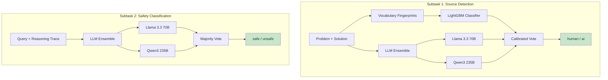

# When Features Die: Domain-Robust AI Detection and Safety Classification

[](https://www.python.org/downloads/)
[](LICENSE)
[](https://pan.webis.de/clef26/pan26-web/index.html)
[](SECURITY.md)
[](https://github.com/astral-sh/ruff)

> Multi-LLM ensemble + vocabulary fingerprint features for detecting AI-generated reasoning and classifying safety of LLM outputs.
>
> **1st place** on both subtasks of the [PAN@CLEF 2026 Reasoning Trajectory Detection](https://pan.webis.de/clef26/pan26-web/index.html) shared task.

---

## The Story

We built a source detector that achieved **0.97 F1** on validation. On the test set, it scored **0.68**. Five of our nine top features had **0% fire rate** on test data.

This happened because the training data was 100% math problems, while the test set was 64% business/finance, 16% math, 13% finance, and 7% coding. Every math-specific feature was dead on arrival.

| Feature | Train Fire Rate | Test Fire Rate | Status |
|---------|:-:|:-:|:-:|
| `has_final_answer` | 93.6% | 0.0% | Dead |
| `reasoning_tag_present` | 99.3% | 0.0% | Dead |
| `has_boxed_answer` | 99.0% | 29.3% | Dying |
| `opens_with_the` | 70.0% | ~5% | Dying |
| `hapax_ratio` | 100% | 100% | **Alive** |
| `compression_ratio` | 100% | 100% | **Alive** |
| `sentence_length_cv` | 100% | 100% | **Alive** |

This repository documents not just the winning system, but the systematic failure analysis and recovery: replacing domain-anchored features with domain-invariant vocabulary fingerprints, and augmenting stylometry with zero-shot LLM classification.

---

## Results

| Subtask | Task | Metric | Score | Approach |
|---------|------|--------|:-----:|----------|
| **S1** | Source Detection (human vs AI) | Macro F1 | **0.75** | LightGBM + multi-LLM ensemble |
| **S2** | Safety Classification (safe vs unsafe) | Macro F1 | **0.55** | Multi-LLM zero-shot classification |

---

## Architecture



---

## Quick Start

### Install

```bash
pip install -e .

# For LLM ensemble (requires API keys)
pip install -e ".[llm]"
```

### Train (Subtask 1)

```bash
python train_s1.py --data data/subtask1/
```

### Predict

```bash
# Feature-based (no API keys needed)
python predict.py -i /input -o /output --mode features

# LLM ensemble (requires TOGETHER_API_KEY)
python predict.py -i /input -o /output --mode llm
```

### Using Make

```bash
make setup          # Install dependencies
make train          # Train both subtasks
make predict        # Run inference
make test           # Verify all modules
make help           # Show all targets
```

---

## Key Contributions

### 1. Feature Death Taxonomy

We classify features into three categories based on their behavior under domain shift:

| Category | Definition | Example | Survival Rate |
|----------|-----------|---------|:---:|
| **Domain-anchored** | Tied to specific generators or topics | `has_final_answer` (DeepSeek marker) | 0% |
| **Domain-portable** | Transfer to related domains | `has_boxed_answer` (math marker) | ~30% |
| **Domain-invariant** | Work across all domains | `hapax_ratio` (vocabulary fingerprint) | 100% |

Most published AI detection features are domain-anchored. They detect "math AI," not "AI."

See [docs/FEATURE_DEATH.md](docs/FEATURE_DEATH.md) for the full analysis.

### 2. Vocabulary Fingerprint Features

Seven domain-invariant features that survive distribution shift, validated via Cohen's d:

| Feature | Cohen's d | Description |
|---------|:---------:|-------------|
| `hapax_ratio` | -0.886 | Fraction of words appearing exactly once |
| `sentence_length_cv` | 0.750 | Coefficient of variation of sentence lengths |
| `yules_k` | moderate | Vocabulary repetitiveness (Yule's K statistic) |
| `heaps_exponent` | moderate | Vocabulary growth rate (Heaps' law) |
| `function_word_ratio` | moderate | Ratio of function words to content words |
| `sentence_compression_cv` | moderate | Variability of per-sentence information density |
| `whitespace_pattern` | moderate | Ratio of double-newlines to single-newlines |

### 3. Multilingual Refusal Detection

A reusable module covering **22 languages** with **100+ compiled regex patterns** for detecting AI safety refusals:

```python
from rtd.refusal_detector import has_refusal

has_refusal("I'm sorry, but I can't assist with that.")  # True
has_refusal("抱歉，我无法协助您的请求。")  # True (Chinese)
has_refusal("Xin lỗi, tôi không thể giúp.")  # True (Vietnamese)
has_refusal("The answer is 42.")  # False
```

Categories: direct refusals, policy citations, redirections, indirect refusals, safety meta-reasoning, model self-identification.

See [docs/MULTILINGUAL_REFUSAL.md](docs/MULTILINGUAL_REFUSAL.md) for full language coverage.

---

## Lessons Learned

### What Didn't Work

| Approach | Val F1 | Test F1 | Why It Failed |
|----------|:------:|:-------:|---------------|
| LightGBM with 28 math-tuned features | 0.97 | 0.68 | 5/9 generator features dead on test |
| 300+ regex refusal heuristic (S2) | 0.62 | 0.35 | Pattern matching != understanding |
| Validation threshold optimization | 0.89 | 0.69 | Val doesn't represent test distribution |

### What Worked

| Approach | Test F1 | Why It Worked |
|----------|:-------:|---------------|
| LLM zero-shot classification | 0.72 (S1), 0.55 (S2) | Semantic understanding transfers across domains |
| Domain-invariant vocabulary features | +0.03 | Hapax ratio, Yule's K survive domain shift |
| Calibrated LLM + LGB ensemble | 0.75 (S1) | LGB confident predictions + LLM for uncertain zone |

---

## Project Structure

```
trajectory-detection-clef2026/
├── rtd/                        # Core package
│   ├── features.py             # 30 S1 + 28 S2 feature extractors
│   ├── data_loader.py          # JSONL data loading
│   ├── evaluate.py             # Macro F1, accuracy, confusion matrix
│   └── refusal_detector.py     # 22-language refusal detection (reusable)
├── llm_ensemble/               # Multi-LLM classification
│   ├── source_detection.py     # S1: human vs AI via LLM ensemble
│   └── safety_classification.py # S2: safe vs unsafe via LLM ensemble
├── train_s1.py                 # S1 training (LightGBM + threshold opt)
├── train_s2.py                 # S2 training (heuristic + LLM)
├── predict.py                  # Unified inference entry point
├── docs/
│   ├── ITERATION_LOG.md        # Full experiment log with failure analysis
│   ├── FEATURE_DEATH.md        # Domain shift feature death analysis
│   └── MULTILINGUAL_REFUSAL.md # Refusal detector documentation
├── Makefile                    # make setup / train / predict / test
├── pyproject.toml
├── Dockerfile
└── .github/workflows/          # CI + SLSA provenance
```

---

## Citation

```bibtex
@inproceedings{condrey2026trajectory,
  title     = {When Features Die: Domain-Robust {AI} Detection and Safety
               Classification via Multi-{LLM} Ensemble},
  author    = {Condrey, David},
  booktitle = {Working Notes of CLEF 2026 -- Conference and Labs of the
               Evaluation Forum},
  year      = {2026}
}
```

---

## License

MIT. See [LICENSE](LICENSE) for details.
