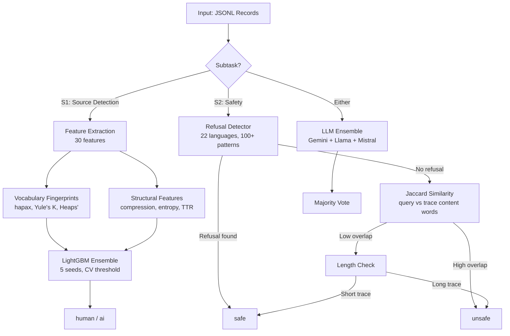

<!-- repo-header:start -->


<h1>When Features Die: Reasoning Trajectory Detection at PAN@CLEF 2026</h1>

<p><strong>PAN@CLEF 2026 Reasoning Trajectory Detection: 1st place source detection (0.85 F1) and 3rd safety classification (0.66 F1) — feature robustness under domain shift.</strong></p>

<br clear="left">

[](https://github.com/dcondrey/trajectory-detection-clef2026/actions/workflows/slsa-provenance.yml) [](.bestpractices.json) [](https://github.com/dcondrey/trajectory-detection-clef2026/blob/main/LICENSE) [](https://github.com/dcondrey/trajectory-detection-clef2026/actions/workflows/slsa-provenance.yml) [](https://github.com/dcondrey/trajectory-detection-clef2026/blob/main/CODE_OF_CONDUCT.md) [](https://github.com/sponsors/dcondrey)
<!-- repo-header:end -->

| Feature | Train Fire Rate | Test Fire Rate | Status |
|---|---|---|---|
| `has_final_answer` | 93.6% | **0.0%** | Dead |
| `reasoning_tag_present` | 99.3% | **0.0%** | Dead |
| `has_boxed_answer` | 99.0% | **29.3%** | Dying |
| `hapax_ratio` | 100% | **100%** | Alive |
| `yules_k` | 100% | **100%** | Alive |
| `sentence_length_cv` | 98% | **97%** | Alive |

The training set was 100% mathematics. The test set was 64% business, 13% finance, 7% coding, and only 16% math. Five of nine generator-specific features had 0% fire rate on the test set. Our classifier was a math-domain overfitting machine.

This repository contains the system we built after that autopsy.

## Official Results (PAN 2026 leaderboard)

| Subtask | Macro F1 | Rank | Final system |
|---|---|---|---|
| **1 — Source Detection** | **0.85** | **1st** of 9 | Claude Opus 4.6 – Sonnet 4.6 agreement (LightGBM breaks ties) |
| **2 — Safety Classification** | **0.66** | **3rd** of 7 | Multi-signal union (also **2nd** on soft F1 at 0.27) |

The feature-based and heuristic components described below are the interpretable backbone; the top scores came from combining them with frontier-LLM agreement. Full analysis is in the paper (see [Citation](#citation)).

## System Overview

**Subtask 1 -- Source Detection:** Is this reasoning trajectory written by a human or an LLM?

We use 30 structural features extracted without any neural model, classified by a multi-seed LightGBM ensemble with cross-validated threshold optimization. The key features are domain-invariant vocabulary fingerprints (hapax ratio with Cohen's d = -0.886, Yule's K, Heaps' exponent) that measure *how* text is generated rather than *what* it is about.

**Subtask 2 -- Safety Classification:** Is this reasoning trace safe, potentially unsafe, or unsafe?

We use a three-rule heuristic classifier: (1) multilingual refusal detection across 22 languages with 100+ regex patterns, (2) content-word Jaccard similarity between query and trace, and (3) trace length thresholds. This achieved F1 = 0.67 compared to 0.36 from our ML classifier that lacked refusal detection.

Both subtasks can optionally use a multi-LLM ensemble (Gemini, Llama, Mistral, Claude, GPT-4o) via majority voting.

## Architecture



## Quick Start

```bash
# Install
uv sync

# Train Subtask 1
uv run python train_s1.py --data-dir data/

# Train Subtask 2 (tune heuristic thresholds)
uv run python train_s2.py --data-dir data/ --tune-thresholds

# Generate predictions
uv run python predict.py --subtask 1 --input data/subtask1/test/
uv run python predict.py --subtask 2 --input data/subtask2/test/
```

### LLM Ensemble (optional)

```bash
export GEMINI_API_KEY=...
export GROQ_API_KEY=...
export TOGETHER_API_KEY=...

uv run python train_s2.py --run-llm-ensemble --models gemini,groq_llama70b,together_llama70b
```

## Key Contributions

### 1. Vocabulary Fingerprints for Cross-Domain Detection

We identify a class of features that survive domain shift because they measure properties of the *generation process* rather than the *content*:

| Feature | Cohen's d | What It Measures |
|---|---|---|
| Hapax ratio | -0.886 | Fraction of words used exactly once |
| Sentence length CV | 0.750 | Variation in sentence lengths |
| Yule's K | 0.620 | Vocabulary repetitiveness |
| Heaps' exponent | -0.540 | Vocabulary growth rate |
| Sentence compression CV | 0.310 | Variation in information density |

See [docs/FEATURE_DEATH.md](docs/FEATURE_DEATH.md) for the full taxonomy of domain-anchored vs domain-portable vs domain-invariant features.

### 2. Multilingual Refusal Detection (22 Languages)

A reusable module (`rtd/refusal_detector.py`) that detects AI safety refusals across 22 languages using 100+ compiled regex patterns. Covers direct refusals, apology-led refusals, policy citations, redirections, safety meta-reasoning, and model self-identification.

```python
from rtd.refusal_detector import has_refusal

has_refusal("I'm sorry, but I can't assist with that.")  # True
has_refusal("抱歉，我无法提供这方面的帮助。")  # True
has_refusal("Xin lỗi, tôi không thể giúp.")  # True
```

See [docs/MULTILINGUAL_REFUSAL.md](docs/MULTILINGUAL_REFUSAL.md) for the complete language coverage and pattern documentation.

### 3. Feature Death Taxonomy

We introduce a three-category taxonomy for feature robustness under domain shift:

- **Domain-Anchored** (fragile): Features tied to specific content formats (`has_boxed_answer`, `latex_density`). These die when the domain changes.
- **Domain-Portable** (moderate): Features that exist across domains but require recalibration (`compression_ratio`, `digit_ratio`).
- **Domain-Invariant** (robust): Features measuring generation process properties (`hapax_ratio`, `yules_k`, `heaps_exponent`). These survive because they capture *how* text is generated.

## Results

### Subtask 1: Source Detection

| Approach | Val F1 | Test F1 |
|---|---|---|
| LightGBM 19-feat (structural only) | 0.9746 | -- (overfit) |
| LightGBM 28-feat (+ generator features) | 0.7139 | 0.6809 |
| LightGBM 30-feat (+ vocab fingerprints) | -- | 0.75 |
| **Opus–Sonnet agreement (final, submitted)** | -- | **0.85 — 1st place** |
| LLM Ensemble (4 models) | -- | competitive |

### Subtask 2: Safety Classification

| Approach | Val Macro F1 | Notes |
|---|---|---|
| All-safe baseline | 0.3601 | Predicts everything as safe |
| ML classifier (v12b) | 0.5018 | 0.3616 on test (collapsed) |
| Refusal regex only | 0.5246 | Single rule |
| Refusal + Jaccard | 0.5772 | Two rules |
| **Refusal + Jaccard + Length** | **0.6686** | Three rules, zero ML |
| LLM Ensemble (4 models) | -- | competitive |

## Project Structure

```
trajectory-detection-clef2026/
  rtd/                          # Core package
    features.py                 # 30 S1 + 28 S2 feature functions
    data_loader.py              # Configurable JSONL data loading
    evaluate.py                 # Evaluation metrics
    refusal_detector.py         # 22-language refusal detection
  llm_ensemble/                 # LLM ensemble classifiers
    source_detection.py         # S1: multi-LLM human/AI detection
    safety_classification.py    # S2: multi-LLM safety classification
  train_s1.py                   # S1 training entry point
  train_s2.py                   # S2 training entry point
  predict.py                    # Inference for both subtasks
  docs/
    FEATURE_DEATH.md            # Feature death analysis
    MULTILINGUAL_REFUSAL.md     # Refusal detection documentation
    ITERATION_LOG.md            # Full experiment tracker
```

## Citation

```bibtex
@inproceedings{condrey2026pan,
  title     = {Writerslogic at {PAN} 2026: Process over Content for Robust
               Detection under Domain Shift},
  author    = {Condrey, David},
  booktitle = {Working Notes of CLEF 2026 -- Conference and Labs of the Evaluation Forum},
  series    = {CEUR Workshop Proceedings},
  year      = {2026},
  publisher = {CEUR-WS.org},
  note      = {Reasoning Trajectory Detection is one of three PAN tasks in this paper; to appear}
}
```

## License

[MIT](LICENSE)
